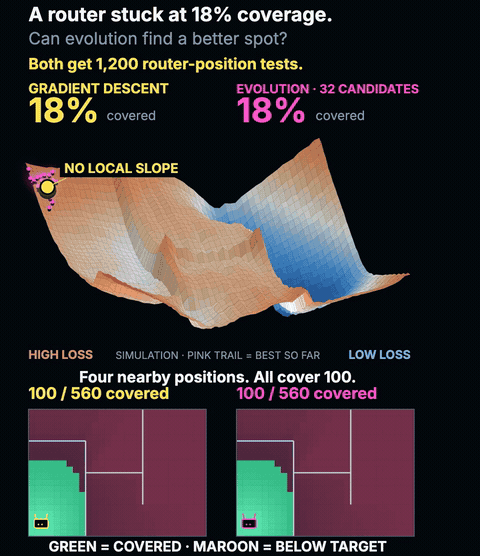

# Router Rumble

Where should you put a Wi-Fi router when the signal barely reaches the bedroom?

Router Rumble explores that question with a small Python simulation. Gradient descent and an evolutionary algorithm search the same home, starting from the same router position. The replay focuses on a coverage-count objective. Gradient descent tests four nearby positions, but each covers the same 100 locations. With no local slope to follow, it stays still. Evolution searches farther away and reaches 208 locations.



Both methods get 1,200 signal evaluations. The replay uses their recorded positions and the signal values calculated by Python. It interpolates between positions to make the motion smooth; those intermediate positions are not additional optimizer evaluations. The coverage counts and signal maps use the recorded states. The pink trail connects the best position found so far.

## Run it yourself

Install [uv](https://docs.astral.sh/uv/getting-started/installation/), then run:

```sh
git clone https://github.com/austin-starks/router-rumble.git
cd router-rumble
uv run run_demo.py
```

The script runs both optimizers, checks 20 evolutionary seeds, and opens the replay in your browser. You can drag the timeline to inspect any moment. It runs locally without a server, API key, or GPU.

You can change the seed and give both methods a larger budget:

```sh
uv run run_demo.py --seed 12 --budget 2400
```

If you already have Python and NumPy installed, `python run_demo.py` works too. You can also open the committed `demo.html` directly to watch a silent replay of the default run.

## What happens in the default run

The featured coverage-count experiment starts with 100 of 560 sampled locations covered, or about 18%. Gradient descent remains there. Evolution, using seed 7, reaches 208 locations, or about 37%. The replay shows this one experiment; the script also runs the three smooth-objective comparisons below.

Coverage means that a sampled location meets the signal target. It does not measure internet speed. The first three experiments maximize a smooth service score, which is related to coverage but is a different metric. The fourth counts covered locations directly.

| Scenario | Start score | Gradient descent | Evolution | Seeds beating GD |
|---|---:|---:|---:|---:|
| Open room | 80.9 | 96.5 | 96.5 | 0 / 20 |
| Partitioned home | 37.1 | 63.6 | 67.1 | 20 / 20 |
| Stronger signal target | 18.1 | 28.0 | 35.9 | 20 / 20 |
| Coverage count objective | 17.9 | 17.9 | 37.1 | 20 / 20 |

In the open room, both methods reach the same rounded score. The difference appears when walls and the signal target create competing good positions. These results show how this particular local search can get stuck; they do not establish that evolution is always better.

Seed 7 was chosen before running the experiment. The audit includes seeds 0 through 19, and counts a win when evolution's final objective score exceeds gradient descent's by more than 0.1 points.

The featured replay optimizes the coverage count directly instead of the smooth service score. All four gradient probes at the start cover the same 100 receivers, so the local gradient is exactly zero and gradient descent never moves. Evolution reaches 208 receivers, or 37% coverage, with seed 7. The flat steps make this a poor objective for finite-difference gradient descent. In this row, the score equals coverage.

## How the search works

The yellow router uses finite-difference gradient descent. It probes four nearby positions to estimate the slope, takes a step, and backtracks if the score gets worse. The pink population starts with 32 candidates, keeps the best eight, and creates 24 mutated offspring for the next generation. It does not use crossover.

Both searches include the exact starting position `(1, 1)`. Evolution also initializes nearby candidates. Gradient descent uses a learning rate of 30 and finite differences spaced 0.03 m apart. Evolution's mutation spread starts at 2.7 m, shrinks by 4.5% per generation, and stops shrinking at 0.18 m.

Every search call counts toward the budget, including gradient probes, trial steps, and population evaluations. Recording diagnostics and the independent reference grid are outside the budget for both methods. Equal evaluation counts do not imply equal runtime, and analytic gradients could make gradient descent cheaper.

## How the signal model works

The simulated home measures 14 × 10 metres and contains 560 sampled receivers. Four walls impose declared penalties of 7 or 9 dB. The small router icon marks its position; only distance and walls affect the signal calculation.

Distance reduces signal according to `-40 - 24*log10(max(distance, 1))` dBm. Wall-crossing masks are softened over 0.18 m so the optimizer has a smooth objective. The service score averages `sigmoid((RSSI-target)/3) × 100` across receivers, while coverage counts receivers at or above the target. The animation displays the loss minimized in each round: `1 - service_score / 100` for the smooth objective, or `1 - coverage / 100` for the coverage count. A lower number is better. Each surface uses its own height and color range to make its shape visible; the coverage percentages provide the numerical comparison in the featured replay.

The wall scenarios use the same geometry. The stronger-signal scenario changes the target from −67 to −57 dBm. The coverage-count scenario retains −57 dBm and changes the objective to `1 - mean(RSSI >= target)`.

## Change the experiment

Edit `ROOMS` in [experiment.py](experiment.py) to move a wall, change its attenuation, or adjust the signal target. Rerun the demo to see how those changes affect the searches. Every signal cell and router position in the replay comes from the new Python results.

| File | What it does |
|---|---|
| `experiment.py` | Defines the signal model, runs both optimizers, and audits the seeds. |
| `run_demo.py` | Runs the experiment and opens the replay. |
| `build_preview.py` | Bundles the recorded positions and signal maps. |
| `visual.js` | Draws the browser replay and the vertical video. |
| `results/results.json` | Stores the reproducible default run. |
| `test_experiment.py` | Checks budgets, bounds, attenuation, and reproducibility. |

Run the tests with:

```sh
uv run --with numpy python -m unittest -v
```

## Limits and references

This is an educational approximation of router placement rather than an RF survey or a calibrated building model. It omits interference, reflections, floors, antenna patterns, furniture attenuation, and channel congestion. The 1 m distance floor introduces a small nonsmooth region.

For real indoor propagation models, see [ITU-R P.1238](https://www.itu.int/rec/R-REC-P.1238) and [ns-3's building models](https://www.nsnam.org/docs/models/html/buildings-design.html).

The visual comparison was inspired by [ModularMind8's gradient-descent versus evolution animation](https://www.reddit.com/r/deeplearning/comments/1wvuu24/gradient_descent_vs_evolution_on_three_loss/). The code and graphics in this repository were newly authored and are available under the [MIT license](LICENSE).
