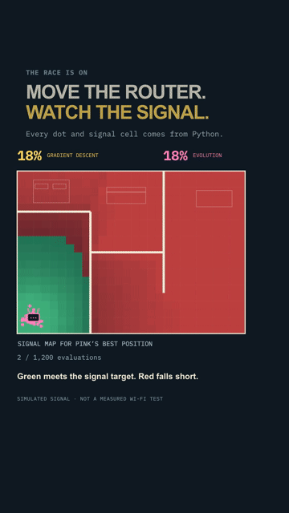

# Router Rumble

**Your Wi-Fi dies in the bedroom. Can an optimizer find a better place for the router?**

A tiny Python experiment pits gradient descent against evolution inside a simulated home. Watch the router move, the signal map change, and one search get stuck while the other explores across the walls.



**Same start. Same 1,200 signal evaluations. Different search strategies.**

## Run the race

Install [uv](https://docs.astral.sh/uv/getting-started/installation/), then:

```sh
git clone https://github.com/austin-starks/router-rumble.git
cd router-rumble
uv run run_demo.py
```

That runs both optimizers, checks 20 evolutionary seeds, and opens a browser replay. Drag the timeline to inspect any moment. No server, API key, or GPU.

Try a different race:

```sh
uv run run_demo.py --seed 12 --budget 2400
```

Already have Python and NumPy? `python run_demo.py` works too. The committed `demo.html` also opens directly as a silent replay of the default experiment.

## The payoff

In the stronger-signal scenario, the starting router serves **100 of 560 sampled locations (18%)**. Gradient descent ends at **28% coverage**. Evolution, with seed 7, ends at **203 of 560 locations (36%)**.

That is simulated signal coverage, **not measured internet speed**. The optimizers maximize a smooth service score; coverage is a separate threshold metric.

| Scenario | Start score | Gradient descent | Evolution | Seeds beating GD |
|---|---:|---:|---:|---:|
| Open room | 80.9 | 96.5 | 96.5 | 0 / 20 |
| Partitioned home | 37.1 | 63.6 | 67.1 | 20 / 20 |
| Stronger signal target | 18.1 | 28.0 | 35.9 | 20 / 20 |

The open-room control matters: both methods reach the same rounded score. This experiment shows a failure mode of local search, not a universal winner. Seed 7 was chosen before running; the audit includes seeds 0–19. A win means a score advantage greater than 0.1.

## How it works

- **Yellow:** finite-difference gradient descent. Probe four nearby positions, follow the slope, and backtrack when a step makes things worse.
- **Pink:** 32 candidates. Keep the best eight, mutate 24 offspring, and repeat. No crossover.
- **The house:** 14 × 10 metres, 560 sampled receivers, four walls with declared 7 or 9 dB penalties. Furniture is decoration.
- **The budget:** all search calls count. Recording diagnostics and the independent reference grid are outside both budgets. Equal evaluations do not mean equal runtime; analytic gradients could be cheaper.

Distance reduces signal as `-40 - 24*log10(max(distance, 1))` dBm. Wall-crossing masks are softened over 0.18 m. The score averages `sigmoid((RSSI-target)/3) × 100`; coverage counts receivers at or above the target. The two wall scenarios share geometry and change the target from −67 to −57 dBm.

Both methods include the exact start `(1, 1)`; evolution also starts nearby candidates. GD uses a learning rate of 30 and 0.03 m finite differences. Evolution's mutation spread starts at 2.7 m, shrinks 4.5% each generation, and bottoms out at 0.18 m.

## Change something meaningful

Edit `ROOMS` in [experiment.py](experiment.py): move a wall, alter its attenuation, or change the signal target. Then rerun the demo. Every signal cell and optimizer position in the animation comes from the Python results.

| File | Purpose |
|---|---|
| `experiment.py` | Signal model, both optimizers, seeded audit |
| `run_demo.py` | One-command experiment and replay |
| `build_preview.py` | Bundle recorded positions and signal maps |
| `visual.js` | Shared animation for the replay and vertical video |
| `results/results.json` | Reproducible default run |
| `test_experiment.py` | Budgets, bounds, attenuation, reproducibility |

```sh
uv run --with numpy python -m unittest -v
```

## What this model leaves out

This is an educational approximation of router placement, not an RF survey or a calibrated building model. It omits interference, reflections, floors, antenna patterns, furniture attenuation, and channel congestion. The 1 m distance floor introduces a small nonsmooth region.

For real indoor propagation models, see [ITU-R P.1238](https://www.itu.int/rec/R-REC-P.1238) and [ns-3's building models](https://www.nsnam.org/docs/models/html/buildings-design.html).

Inspired by [ModularMind8's gradient-descent versus evolution animation](https://www.reddit.com/r/deeplearning/comments/1wvuu24/gradient_descent_vs_evolution_on_three_loss/). Code and graphics are newly authored. [MIT license](LICENSE).
